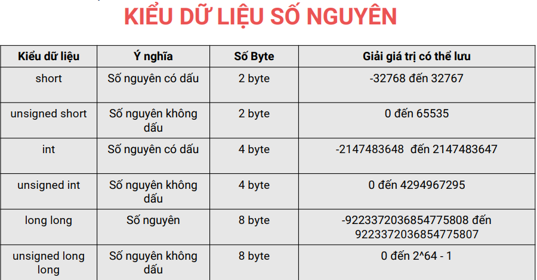

# LẬP TRÌNH C

## Bài 1. programming in C 
Hàm main là nơi bắt đầu thực thi của chương trình.

Những phần chính của một chương trình C:
- Thư viện mà chương trình sử dụng.
- Chương trình chính với mã nguồn.

Những chú ý khi viết chương trình C:
- Các câu lệnh kết thúc bằng dấu ";"
- Luôn thụt lề các câu lệnh so với hàm main.

## Bài 2. Kiểu dữ liệu(Data type)
Kiểu dữ liệu: để lưu các dữ liệu về số, kí tự, văn bản,...

### Kiểu dữ liệu số nguyên 
1 byte = 8 bit
Đối với số nguyên ta chia làm số nguyên có dấu và số nguyên không dấu, từ số byte lưu trữ ta có thể suy ra số bit cần để biểu diển số nguyên đó, quy tắc xác định giá trị của 1 số nguyên:
Giả sử số nguyên có k bit
- Số nguyên có dấu: - 2^k-1 tới 2^k-1 - 1
- Số nguyên không dấu: 0 tới 2^k - 1

 

### Kiểu dữ liệu số thực:


### Kiểu dữ liệu đúng sai:
Kiểu dữ liệu: int
Ý nghĩa: Kiểu dữ liệu luận ý 
Số Byte: 4 byte
Giải giá trị có thể lưu: 1 là đúng, 0 là sai

### Kiểu dữ liệu ký tự:
Kiểu dữ liệu: char
Ý nghĩa: Kiểu dữ liệu ký tự
Số Byte: 1 byte
Giải giá trị có thể lưu: -128 tới 127

### Tổng quan về kiểu dữ liệu:
- Kiểu số nguyên có int và long long.
    Sử dụng long long cho các kết quả là số lớn.
- Kiểu số thực có float và double.
    Sử dụng double vì có độ chính xác cao.
- Kiểu đúng sai dùng kiểu int.
- Kiểu ký tự có char.

### Đặc tả các kiểu dữ liệu chính
Trong ngôn ngữ lập trình C, bạn cần nắm được đặc tả của các kiểu dữ liệu. Đặc tả đặc biệt quan trong vì nó giúp các bạn có thể nhập giá trị cho biến từ bàn phím và in ra giá trị của biến lên màn hình.

Kiểu dữ liệu: int có đặc tả tương ứng: %d
Kiểu dữ liệu: long long có đặc tả tương ứng: %lld
Kiểu dữ liệu: float có đặc tả tương ứng: %f
Kiểu dữ liệu: double có đặc tả tương ứng: %lf
Kiểu dữ liệu: char có đặc tả tương ứng: %c

## Bài 3. Biến(Variable)
### Biến(Variable)
Biến được sử dụng để lưu các giá trị trong quá trình tính toán
của chương trình. Tùy theo kiểu dữ liệu của biến, một ô trong bộ nhớ sẽ được cấp phát để lưu trữ giá trị của biến này. 

SYNTAX(CÚ PHÁP):

```C
//Data_Type Variable_Name;
int a_variable;
```

Ví dụ:
int x;
long long b;
char ki_tu;
int check;
double dientich;

Quy tắc đặt tên biến:
- Không đặt tên biến bắt đầu bằng chữ số
    Ví dụ cách đặt sai: 1dientich, 2chuvi, 222bankinh, 9a,...
- Tên biến không được chứa dấu cách và các kí tự đặt biệt
    Ví dụ cách đặt sai: ban kinh, dien#tich, chu@vi,...
- Tên biến không được trùng với tên từ khóa trong C
    Ví dụ cách đặt sai: int, for, while,...
- Tên biến trong C là phân biệt hoa thường
    Ví dụ cách đặt sai: banKinh và BanKinh là 2 biến khác nhau
- Không được đặt 2 biến có cùng tên trong cùng một phạm vi
    Ví dụ cách đặt sai: int a; float a;

Lưu ý: Không nên đặt tên biến quá dài, nên đặt tên biến có ý nghĩa. 